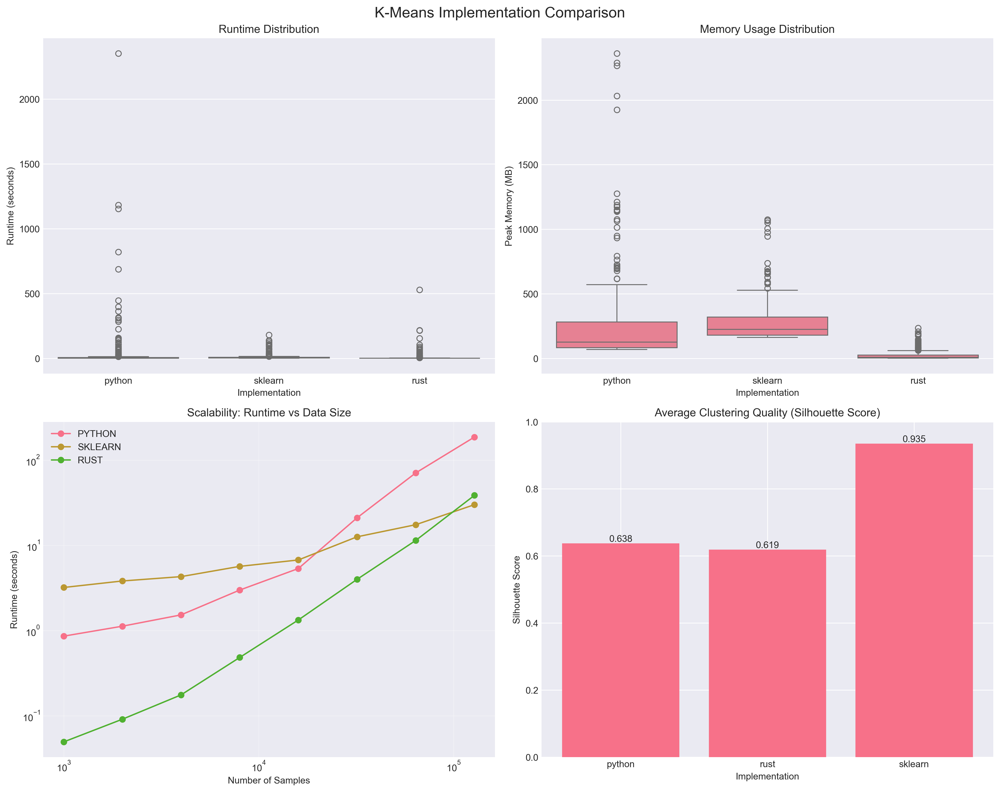

# pythonvsrust-kmeans

A comparative study of K-Means clustering implementations written in pure Python, Rust and scikit-learn.  
The repository is structured so that you can generate synthetic data, run each implementation under identical scenarios, capture execution metrics and visualise the results.




---

## 📁 Directory structure

```
pythonvsrust-kmeans/
│
├── data/                # Auto-generated datasets (CSV/NPY) used in the benchmarks
├── notebooks/           # Jupyter notebooks used to explore data and analyse results
├── results/             # Raw benchmark results and summary statistics
│
├── src/                 # Source code for the experiment
│   ├── generate_data.py # Helper script to create synthetic datasets of varying size & dimensionality
│   ├── python_impl/     # Pure-Python reference implementation of K-Means
│   │   ├── kmeans.py    # Main K-Means implementation
│   │   └── README.md    # Python implementation details
│   ├── rust_impl/       # Rust implementation (compiled to a CLI binary)
│   │   ├── src/         # Rust source code
│   │   ├── target/      # Rust build artifacts (gitignored)
│   │   ├── Cargo.toml   # Rust package manifest
│   │   ├── Cargo.lock   # Rust dependency lock file
│   │   └── README.md    # Rust implementation details
│   ├── sklearn_impl/    # Thin wrapper around sklearn.cluster.KMeans
│   │   └── kmeans.py    # scikit-learn wrapper implementation
│   └── README.md        # Source code documentation
│
├── runner.py            # Top-level orchestrator that drives data gen, runs each impl & records metrics
│
├── pixi.toml           # Pixi dependency management configuration
├── pixi.lock           # Lock file for reproducible environments
├── .gitignore          # Standard Git exclusions
└── README.md           # You are here ✅
```

---

## 🚀 Getting Started

### Prerequisites

This project uses [Pixi](https://pixi.sh/) for dependency management, which provides a reproducible environment across different machines.

1. **Install Pixi** (if not already installed):
   ```bash
   curl -fsSL https://pixi.sh/install.sh | bash
   ```

2. **Clone the repository**:
   ```bash
   git clone https://github.com/yourusername/pythonvsrust-kmeans.git
   cd pythonvsrust-kmeans
   ```

3. **Install dependencies**:
   ```bash
   pixi install
   ```

### Running the benchmarks

1. **Generate synthetic datasets**:
   ```bash
   pixi run python src/generate_data.py
   ```

2. **Run the full benchmark suite**:
   ```bash
   pixi run python runner.py
   ```

3. **View results**:
   Results are saved in the `results/` directory as CSV files and visualization plots.

### Using Pixi Tasks (Recommended)

The project includes pre-defined pixi tasks that streamline common workflows:

#### Quick Start
```bash
# Run everything with one command (build Rust, generate data, run benchmarks)
pixi run run-all

# Or for a quick test with smaller datasets
pixi run run-quick
```

#### Data Generation
```bash
pixi run generate-data      # Generate all default datasets
pixi run generate-small     # Small dataset (1K samples)
pixi run generate-medium    # Medium dataset (10K samples)
pixi run generate-large     # Large dataset (100K samples)
```

#### Building
```bash
pixi run build-rust         # Build Rust implementation (release mode)
pixi run build-rust-debug   # Build Rust implementation (debug mode)
```

#### Testing Individual Implementations
```bash
pixi run test-python        # Test Python implementation
pixi run test-rust          # Test Rust implementation
pixi run test-sklearn       # Test scikit-learn implementation
```

#### Benchmarking
```bash
pixi run benchmark          # Run default benchmark suite
pixi run benchmark-quick    # Quick benchmark with fewer parameters
pixi run benchmark-full     # Comprehensive benchmark (takes longer)
```

#### Utilities
```bash
pixi run clean-data         # Remove generated datasets
pixi run clean-results      # Remove benchmark results
pixi run clean-all          # Clean everything
```

#### Help
```bash
pixi run help               # List available pixi tasks
```

---

## 🎯 Project goal

K-Means is one of the most widely-used clustering algorithms but its performance profile can vary dramatically depending on implementation language, data layout and compilation strategy.  The aim of this project is therefore **to quantify how a hand-rolled Python implementation, a high-performance Rust implementation and the industrial-strength scikit-learn implementation behave under a matrix of realistic workloads**.

The comparison focuses on three axes:

1. **Runtime** – wall-clock time spent in the `fit` phase.
2. **Memory usage** – peak resident set size (RSS) while clustering.
3. **Result quality** – inertia / within-cluster sum-of-squares to ensure all variants reach comparable minima.

By systematically sweeping through different dataset sizes (\(10^3\) – \(10^6\) samples), dimensionalities (2 – 128 features) and cluster counts (2 – 64), I hope to surface the trade-offs that practitioners can expect in production.

---

## 🛠️ Implementation strategy

1. **Synthetic data generation**  
   A single source of truth (`src/generate_data.py`) produces repeatable Gaussian blobs so that each implementation receives identical input.  Datasets are cached under `data/` using a hashed filename that encodes `n_samples`, `n_features` and `n_clusters`.

2. **Algorithm implementations**
   * **Pure Python (`src/python_impl/kmeans.py`)** – A straightforward NumPy-based reference that mirrors the textbook algorithm with no low-level optimisations. Serves as the baseline. Can be run as a CLI tool.
   * **Rust (`src/rust_impl`)** – Simplified implementation in `rust` and compiled to a CLI tool that accepts the dataset path, output path to save and max n-clusters to run clustering. The binary is called from Python via `subprocess` so that timing/memory are captured from the shell. Build with `cargo build --release` in the `src/rust_impl/target/release` directory.
   * **scikit-learn (`src/sklearn_impl/kmeans.py`)** – A thin wrapper that delegates to `sklearn.cluster.KMeans`, providing a mature C-accelerated yardstick. Also executable as a CLI tool.

3. **Benchmark harness (`runner.py`)**
   * Parses experiment parameters (either CLI flags or pre-defined defaults).
   * Ensures the necessary datasets exist, generating them on the fly if required.
   * Executes each implementation in isolation while recording runtime with Python's `time.perf_counter` and memory with `psutil.Process.memory_info`.
   * Emits a `.csv` per scenario into `results/` containing metrics for each language variant.
   * Rusn a basic comparative analysis using these metrics and visualizes them.

4. **Analysis notebooks** [to-do] 
   The `notebooks/` directory contains exploratory notebooks that pivot/plot the raw results – e.g. runtime vs. sample count log-log plots, memory heatmaps, silhouette scores, etc.

---

## 📦 Dependencies

The project uses Pixi for dependency management, which handles both Python and Rust toolchains. Key dependencies include:

- **Python 3.11**: Core language runtime
- **NumPy & Pandas**: Data manipulation and numerical computing
- **scikit-learn**: Reference K-Means implementation
- **Matplotlib & Seaborn**: Visualization
- **Rust toolchain**: For compiling the Rust implementation
- **psutil**: Process monitoring for memory usage tracking

All dependencies are specified in `pixi.toml` and locked in `pixi.lock` for reproducibility.

---