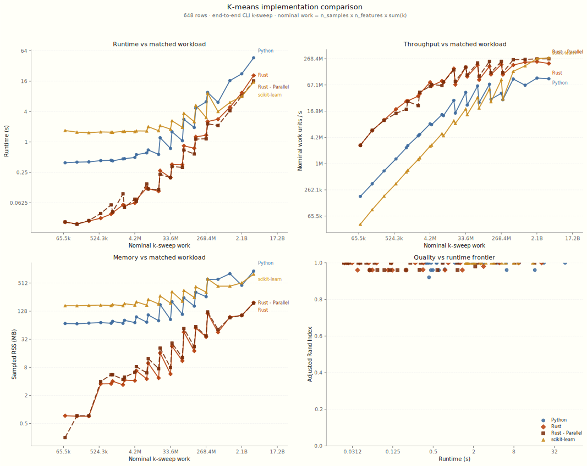

# pythonvsrust-kmeans

I wrote K-Means four ways — pure-NumPy Python, hand-rolled serial Rust, the same
Rust with a Rayon parallel path, and a thin wrapper over scikit-learn — and
benchmarked all four as end-to-end command-line jobs on my laptop. This repo holds
the implementations, the harness that times them, and the figures and write-up that
came out of it.

The short version: serial Rust clusters about as well as the others while running
roughly four to five times faster than the Python reference and using a tenth of
its memory. scikit-learn is the fastest thing here only at the very largest
workload, and it pays for that speed in RAM. The Rayon parallel path tops out at a
1.32x speedup, and only on the biggest jobs.

**Read the full write-up:** [the GitHub Pages site](https://nilesh-patil.github.io/pythonvsrust-kmeans/)
renders every number as a figure-centric technical essay, with the methodology, an
interactive Plotly dashboard, and a [live in-browser demo](https://nilesh-patil.github.io/pythonvsrust-kmeans/demo/)
that runs the Rust K-Means compiled to WebAssembly — six point distributions, step
animation, and a WASM-vs-pure-JS speed race.



## What's in here

```
pythonvsrust-kmeans/
├── data/             # Auto-generated datasets (CSV/NPY); gitignored
├── notebooks/        # Exploratory analysis of the raw results
├── results/          # Benchmark CSVs, PNGs, GIFs, dashboard HTML
│   ├── animations/   # Lloyd's-iteration GIFs
│   └── dashboards/   # Interactive Plotly HTML
│
├── docs/             # Jekyll site, served straight from here by GitHub Pages
│   ├── _config.yml   # Site config (baseurl, theme)
│   ├── _layouts/     # Page layouts
│   ├── assets/       # Mirrored PNGs/GIFs, CSS, demo JS
│   ├── wasm/         # Rust compiled to WebAssembly + JS glue
│   └── *.md          # Pages: index, algorithms, parallel, benchmarks, demo, about
│
├── specs/            # Spec-Driven Development docs, one per feature
├── tests/            # pytest suite (init, animations, metrics, site, bench)
│
├── src/
│   ├── generate_data.py            # Synthetic blobs + ground-truth labels
│   ├── animate_convergence.py      # Lloyd's-iteration GIFs
│   ├── visualize_init_comparison.py
│   ├── visualize_parallel_scaling.py
│   ├── bench_parallel_scaling.py   # Rust thread-count sweep
│   ├── build_dashboard.py          # Interactive Plotly dashboard
│   ├── analysis_audit.py           # Audited source for every quoted figure
│   ├── viz_style.py                # Shared chart styling: colors + display names
│   ├── sync_assets.py              # Mirror results/ into docs/assets/
│   ├── python_impl/                # Pure-Python K-Means (random + k-means++)
│   ├── rust_impl/                  # Rust CLI binary + lib (serial + Rayon)
│   ├── sklearn_impl/               # Thin sklearn wrapper
│   └── wasm_impl/                  # WebAssembly build of the Rust K-Means
│
├── runner.py         # Orchestrator: data gen, run each impl, capture metrics
├── pixi.toml         # Pixi dependency + task config
└── pixi.lock         # Lock file for reproducible environments
```

## The four implementations

The paths are deliberately matched so the comparison is about mechanics, not
algorithm choice. Every run uses k-means++ seeding with a single start, including
scikit-learn at `n_init=1`.

- **Python** (`src/python_impl/kmeans.py`) — about 150 lines of NumPy that mirror
  the textbook algorithm with no low-level tricks. It exists to be read.
- **Rust** (`src/rust_impl`) — a faithful translation of the same Lloyd's
  algorithm, a single CLI binary with an opt-in Rayon parallel path behind
  `--parallel --threads 0`. Called from Python as a subprocess so timing and
  memory are measured from the outside.
- **scikit-learn** (`src/sklearn_impl/kmeans.py`) — a thin shim over
  `sklearn.cluster.KMeans`, standing in for the production answer with its
  compiled C kernels underneath.

## Running it

Everything runs through [Pixi](https://pixi.sh/), which pins both the Python 3.11
and Rust 1.87 toolchains for reproducibility.

```bash
# install Pixi if you don't have it
curl -fsSL https://pixi.sh/install.sh | bash

git clone https://github.com/nilesh-patil/pythonvsrust-kmeans.git
cd pythonvsrust-kmeans
pixi install
```

Build the Rust binary, then run the benchmark suite:

```bash
pixi run build-rust

# the full orchestrated run
pixi run python runner.py

# or reproduce the exact suite behind the website's numbers
pixi run python src/run_current_benchmark_suite.py
```

Results land in `results/` as CSV files and figures. Each benchmark cell produces
one row per implementation — `python`, `sklearn`, `rust` (serial), and
`rust_parallel` (Rayon) — recording wall time, child-process CPU time, effective
cores, sampled RSS, normalized throughput, ARI/NMI, and paired speedups. Chart
colors and display names for every implementation are centralized in
`src/viz_style.py`, shared across matplotlib, Plotly, and the figures.

Rebuild the derived artifacts and check every quoted number:

```bash
pixi run python src/build_dashboard.py
pixi run python src/sync_assets.py

# the single source of truth for every median, speedup, and quality figure
pixi run python src/analysis_audit.py
```

Build the in-browser demo from the same Rust math:

```bash
cd src/wasm_impl && wasm-pack build --target web --out-dir ../../docs/wasm
```

### Common Pixi tasks

```bash
pixi run run-all          # build Rust, generate data, run the suite
pixi run run-quick        # the same on smaller datasets
pixi run build-rust       # cargo build --release in src/rust_impl
pixi run test             # full pytest run
pixi run benchmark        # default benchmark suite
pixi run generate-data    # all default datasets
pixi run clean-all        # remove generated data and results
pixi run help             # list every available task
```

## What gets measured

A run here is a full CLI invocation timed end to end, not a warm function call.
The wall time includes process launch, reading the dataset off disk, fitting every
`k` from 1 to k_max, and writing the cluster columns back out — startup and I/O are
in the measurement on purpose, because that's the cost you actually pay.

- **Runtime** — `time.perf_counter` around the subprocess.
- **Memory** — `psutil.Process.memory_info().rss`, polled every 10 ms and reported
  as the peak. This is a sampled process-RSS estimate, not a platform max-RSS
  reading, so treat the ratios as directional rather than exact.
- **Quality** — adjusted Rand index and NMI against the ground-truth labels the
  data was generated from, plus the usual internal metrics.

The final suite is 648 paired rows: a log2 sample sequence from 1,000 to
256,000 rows, crossed with 2, 8, and 32 features and k_max values of 8 and 32,
three repeats each. The methodology and every caveat are written up on the
[benchmarks page](https://nilesh-patil.github.io/pythonvsrust-kmeans/benchmarks/).

## Lloyd's iterations, animated

| random init | k-means++ init | pathological seed | two moons | concentric rings |
|---|---|---|---|---|
|  |  |  |  |  |

A random start converges slowly when two centroids land in the same blob (third
panel); k-means++ usually picks one centroid per blob on the first try (second
panel) and converges in two or three iterations. The right-hand panels are
K-Means' two classic failures — moons get bisected and rings get pie-sliced —
because the algorithm draws convex Voronoi boundaries and neither shape has any.
The [algorithms page](https://nilesh-patil.github.io/pythonvsrust-kmeans/algorithms/)
works through why.
