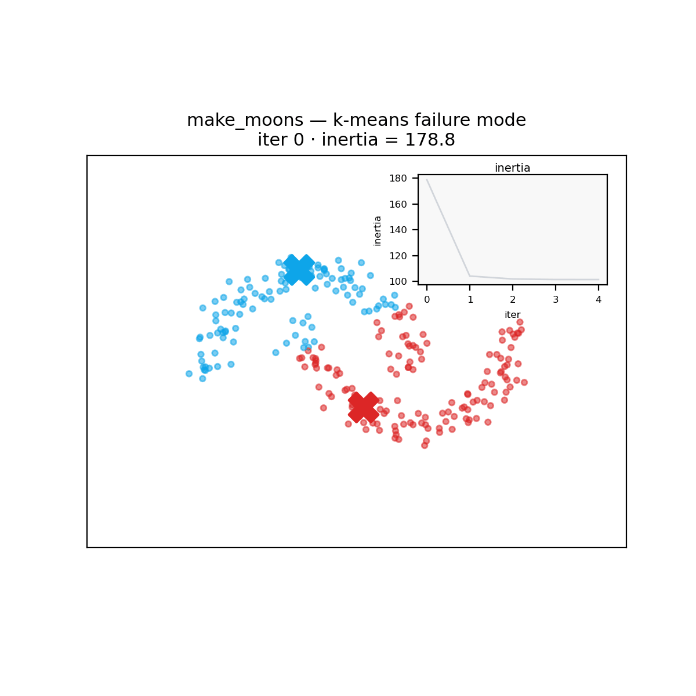
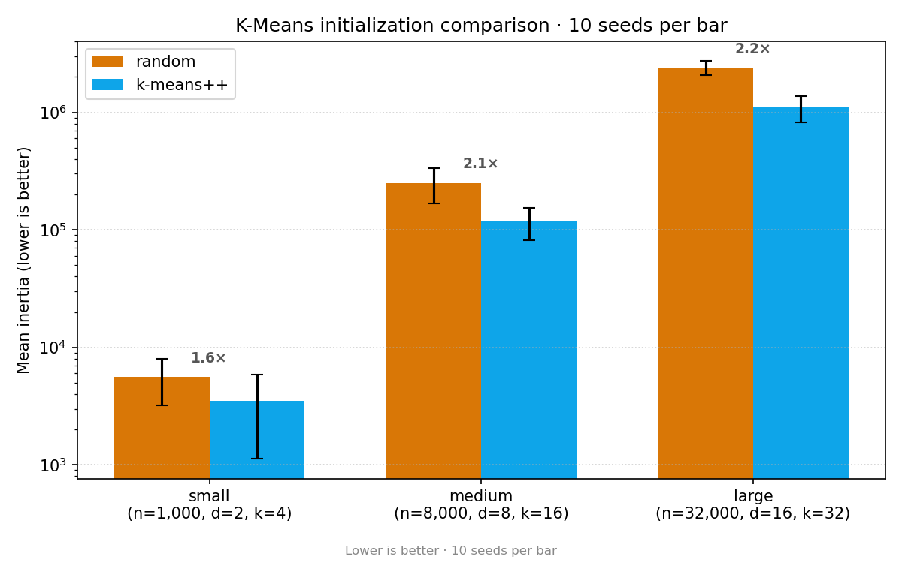

Algorithms

# Lloyd's algorithm and the cost of bad initialization

K-Means is **Lloyd's algorithm**: alternate between assigning each point to its nearest centroid and updating each centroid to the mean of its members. Iterate until labels stop changing.

The catch — the final result depends on where you start.

  

    <h4>Random init</h4>
    
Pick <code>k</code> data points uniformly at random. <strong>When it bites:</strong> two centroids often land in the same dense blob, leaving a real cluster unseeded.

  

  

    <h4>k-means++</h4>
    
First centroid uniform; each next centroid sampled proportional to D²(point, nearest existing centroid). <strong>Why it works:</strong> almost always picks one centroid per region, even on adversarial seeds.

  

## Animation: random vs k-means++ vs failure modes

| random init | k-means++ init | pathological random | two moons | concentric rings |
|---|---|---|---|---|
|  |  |  |  |  |

Notice how the pathological random seed (third) leaves two centroids stuck in the same blob for many iterations. k-means++ (second) converges in 2–3 iterations because each blob is hit on the first pass. The right-hand panels show k-means' two classic failure modes — <em>moons get bisected</em> and <em>rings get pie-sliced</em> because k-means imposes Voronoi (convex-polytope) cluster boundaries.

## Inertia: random vs k-means++

Across three dataset sizes, k-means++ produces **37–54 % lower inertia** averaged over 10 seeds:

## Algorithm in four lines

For a dataset `X ∈ ℝ^{n×d}` and target cluster count `k`:

1. **Initialize** `k` centroids (random or k-means++).
2. **Assign**: every point goes to its nearest centroid (Euclidean).
3. **Update**: every centroid becomes the mean of its assigned points.
4. **Check** convergence (labels stable) — break, else loop.

The pure-Python implementation in [`src/python_impl/kmeans.py`](https://github.com/nilesh-patil/pythonvsrust-kmeans/blob/master/src/python_impl/kmeans.py) is ~150 lines of NumPy and serves as the readable reference. The Rust port in [`src/rust_impl/`](https://github.com/nilesh-patil/pythonvsrust-kmeans/tree/master/src/rust_impl) is a faithful port with the same algorithm — now with an opt-in Rayon parallel path.

