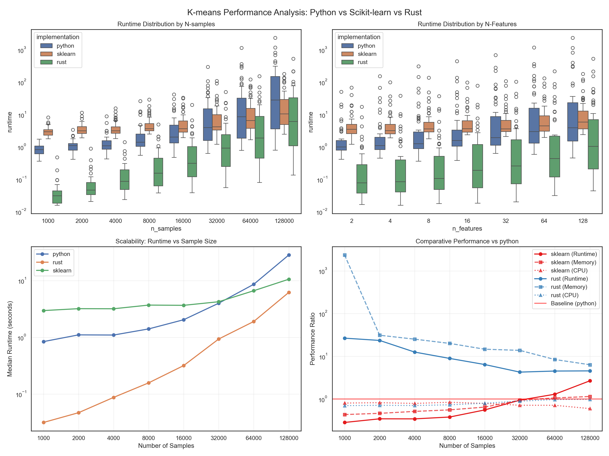

<section class="hero-titan">
  

    A K-Means clustering study
    <h1>Three implementations. One precise comparison.</h1>
    

      Pure Python, hand-rolled Rust (serial and Rayon-parallel), and scikit-learn — measured on runtime, memory, and clustering quality. With a live in-browser WebAssembly demo of the Rust implementation.
    

    

      <a class="btn-primary" href="{{ '/demo/'       | relative_url }}">Try the live demo</a>
      <a class="btn-ghost"   href="{{ '/benchmarks/' | relative_url }}">View benchmarks</a>
    

  

  

    <svg viewBox="0 0 400 400" xmlns="http://www.w3.org/2000/svg" aria-hidden="true">
      <defs>
        <pattern id="grid" width="40" height="40" patternUnits="userSpaceOnUse">
          <path d="M 40 0 L 0 0 0 40" fill="none" stroke="#d8d3cc" stroke-width="0.5"/>
        </pattern>
      </defs>
      <rect width="400" height="400" fill="url(#grid)"/>
      <!-- Cluster A -->
      <g fill="#111111">
        <circle cx="100" cy="120" r="5"/><circle cx="120" cy="100" r="5"/>
        <circle cx="90" cy="140" r="5"/><circle cx="135" cy="125" r="5"/>
        <circle cx="115" cy="145" r="5"/><circle cx="105" cy="105" r="5"/>
        <circle cx="125" cy="155" r="5"/><circle cx="95" cy="115" r="5"/>
      </g>
      <!-- Cluster B -->
      <g fill="#111111">
        <circle cx="280" cy="110" r="5"/><circle cx="295" cy="130" r="5"/>
        <circle cx="265" cy="125" r="5"/><circle cx="305" cy="105" r="5"/>
        <circle cx="290" cy="150" r="5"/><circle cx="275" cy="95" r="5"/>
        <circle cx="310" cy="140" r="5"/><circle cx="285" cy="135" r="5"/>
      </g>
      <!-- Cluster C -->
      <g fill="#111111">
        <circle cx="190" cy="280" r="5"/><circle cx="210" cy="290" r="5"/>
        <circle cx="175" cy="275" r="5"/><circle cx="220" cy="270" r="5"/>
        <circle cx="200" cy="305" r="5"/><circle cx="185" cy="295" r="5"/>
        <circle cx="215" cy="305" r="5"/><circle cx="195" cy="265" r="5"/>
      </g>
      <!-- Centroids -->
      <g stroke="#ff9900" stroke-width="2.5" fill="none">
        <path d="M105,125 l16,0 M113,117 l0,16"/>
        <path d="M283,125 l16,0 M291,117 l0,16"/>
        <path d="M193,285 l16,0 M201,277 l0,16"/>
      </g>
      <!-- Voronoi-ish lines -->
      <g stroke="#615e5b" stroke-width="1" fill="none" opacity="0.5">
        <line x1="195" y1="0" x2="205" y2="200"/>
        <line x1="0" y1="220" x2="400" y2="200"/>
      </g>
    </svg>
  

</section>

At a glance

  

    5.2×
    Rust over pure-Python — mean runtime
  

  

    0.83
    MB / 1k samples — Rust, memory champion
  

  

    1.00
    ARI — scikit-learn recovers ground truth
  

  

    24KB
    Rust → WebAssembly module size
  

## What you'll find here

  <a class="card" href="{{ '/algorithms/' | relative_url }}" style="border-bottom: none;">
    <h4>Algorithms →</h4>
    
k-means++ vs random initialization, animated — including k-means' two classic failure modes (moons and rings).

  </a>
  <a class="card" href="{{ '/parallel/' | relative_url }}" style="border-bottom: none;">
    <h4>Parallelism →</h4>
    
Adding Rayon to the Rust implementation: how the parallel update step works, and what it bought us on a 14-core machine.

  </a>
  <a class="card" href="{{ '/benchmarks/' | relative_url }}" style="border-bottom: none;">
    <h4>Benchmarks →</h4>
    
Interactive Plotly dashboard across runtime, memory, internal quality (silhouette / Davies-Bouldin), and external quality (ARI / NMI).

  </a>
  <a class="card" href="{{ '/demo/' | relative_url }}" style="border-bottom: none;">
    <h4>Live demo →</h4>
    
Run the Rust K-Means in your browser via WebAssembly — six point distributions, step-by-step animation, WASM-vs-JS speed race.

  </a>

## The headline numbers

| Metric                    | Python | Rust | Rust&nbsp;-&nbsp;Parallel | scikit-learn |
|---------------------------|:---:|:---:|:---:|:---:|
| Mean runtime              | slowest | **fastest** (5.2×) | comparable | 3.5× |
| Mean MB / 1k samples      | moderate | **0.83** (lowest) | 1.3 | 47.9 (highest) |
| Silhouette @ k=k_true     | 0.67 | 0.61 | 0.61 | **0.93** |
| Adjusted Rand Index       | 0.74 | 0.66 | 0.66 | **1.00** |

(Numbers are from the latest 48-experiment quick benchmark. See the [Benchmarks](benchmarks/) page for the full sweep.)

  <h2>Open the live demo.</h2>
  
Generate two-moons data, watch Lloyd's algorithm fail in real time, then try the same data with k-means++ — all in your browser.

  

    <a class="btn-primary" href="{{ '/demo/' | relative_url }}">Open the live demo</a>
    <a class="btn-ghost"   href="https://github.com/nilesh-patil/pythonvsrust-kmeans">Star on GitHub</a>
  

