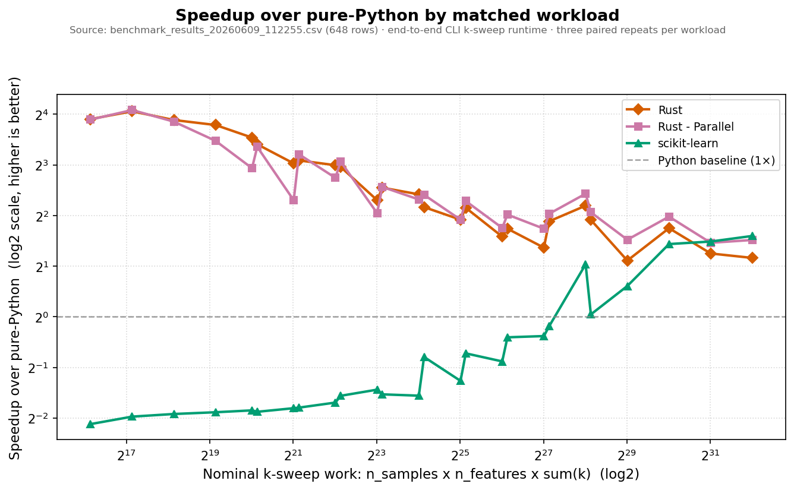
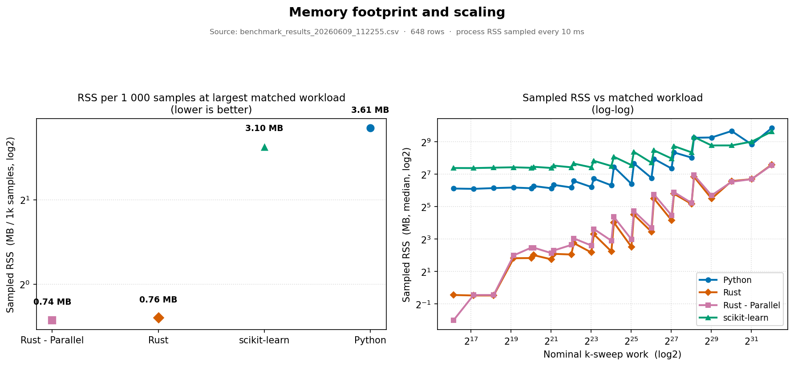
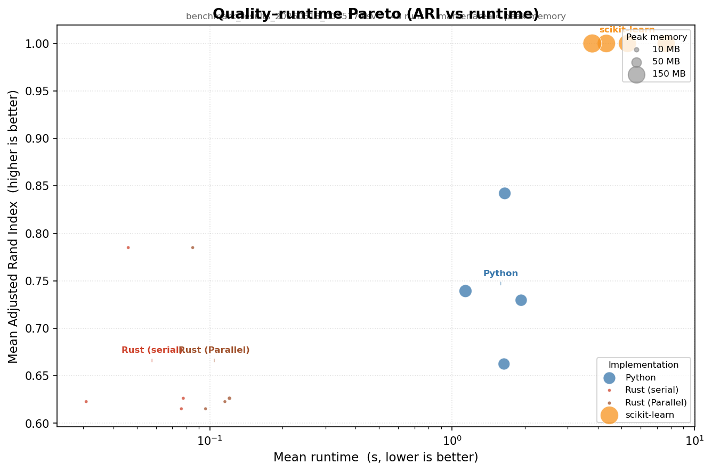

<section class="hero-titan">
  

    A K-Means clustering study
    <h1>Three implementations. One precise comparison.</h1>
    

      Pure Python, hand-rolled Rust (serial and Rayon-parallel), and scikit-learn — measured on runtime, memory, and clustering quality. With a live in-browser WebAssembly demo of the Rust implementation.
    

    

      <a class="btn-primary" href="{{ '/demo/'       | relative_url }}">Try the live demo</a>
      <a class="btn-ghost"   href="{{ '/benchmarks/' | relative_url }}">View benchmarks</a>
    

  

  

    <svg viewBox="0 0 400 400" xmlns="http://www.w3.org/2000/svg" aria-hidden="true">
      <defs>
        <pattern id="grid" width="40" height="40" patternUnits="userSpaceOnUse">
          <path d="M 40 0 L 0 0 0 40" fill="none" stroke="#d8d3cc" stroke-width="0.5"/>
        </pattern>
      </defs>
      <rect width="400" height="400" fill="url(#grid)"/>
      <!-- Cluster A -->
      <g fill="#111111">
        <circle cx="100" cy="120" r="5"/><circle cx="120" cy="100" r="5"/>
        <circle cx="90" cy="140" r="5"/><circle cx="135" cy="125" r="5"/>
        <circle cx="115" cy="145" r="5"/><circle cx="105" cy="105" r="5"/>
        <circle cx="125" cy="155" r="5"/><circle cx="95" cy="115" r="5"/>
      </g>
      <!-- Cluster B -->
      <g fill="#111111">
        <circle cx="280" cy="110" r="5"/><circle cx="295" cy="130" r="5"/>
        <circle cx="265" cy="125" r="5"/><circle cx="305" cy="105" r="5"/>
        <circle cx="290" cy="150" r="5"/><circle cx="275" cy="95" r="5"/>
        <circle cx="310" cy="140" r="5"/><circle cx="285" cy="135" r="5"/>
      </g>
      <!-- Cluster C -->
      <g fill="#111111">
        <circle cx="190" cy="280" r="5"/><circle cx="210" cy="290" r="5"/>
        <circle cx="175" cy="275" r="5"/><circle cx="220" cy="270" r="5"/>
        <circle cx="200" cy="305" r="5"/><circle cx="185" cy="295" r="5"/>
        <circle cx="215" cy="305" r="5"/><circle cx="195" cy="265" r="5"/>
      </g>
      <!-- Centroids -->
      <g stroke="#ff9900" stroke-width="2.5" fill="none">
        <path d="M105,125 l16,0 M113,117 l0,16"/>
        <path d="M283,125 l16,0 M291,117 l0,16"/>
        <path d="M193,285 l16,0 M201,277 l0,16"/>
      </g>
      <!-- Voronoi-ish lines -->
      <g stroke="#615e5b" stroke-width="1" fill="none" opacity="0.5">
        <line x1="195" y1="0" x2="205" y2="200"/>
        <line x1="0" y1="220" x2="400" y2="200"/>
      </g>
    </svg>
  

</section>

At a glance

  

    5.2×
    Rust over pure-Python — mean runtime
  

  

    0.83
    MB / 1k samples — Rust, memory champion
  

  

    1.00
    ARI — scikit-learn recovers ground truth
  

  

    24KB
    Rust → WebAssembly module size
  

Rust is 5.17× faster than Python on the mean runtime across the full 336-configuration sweep. scikit-learn sits in between — 3.46× faster than Python — but the memory picture inverts sharply: sklearn uses 12× more peak memory than Rust (47.88 MB/1k samples vs 0.83 MB/1k samples). The speed headline comes with a quality caveat. sklearn achieves ARI = 1.00 on every measured run; Rust averages 0.66, with a worst-case of 0.35.

## Runtime: speed wins, but scaling exposes a different story

Rust's lead over Python is largest at small n. At n = 1 000, Rust finishes in 0.05 s vs Python's 0.86 s — a 17× gap. At n = 128 000, the gap narrows to 4.83× (38.64 s vs 186.74 s). The scaling exponents explain why: Python 0.71, Rust 1.06, sklearn 0.29.

sklearn's sub-linear exponent reflects BLAS vectorisation — matrix operations that amortise well as n grows; Rust's clean Lloyd's loop does not share that property. The practical consequence is direct: at n = 128 000, Rust (38.64 s) is already slower than sklearn (30.06 s) on the mean. That inverts the headline for large-scale workloads.

## Memory: Rust is in a different league

Mean peak memory per 1 000 samples: Rust 0.83 MB, Python 25.18 MB, sklearn 47.88 MB. The absolute ranges across all configurations tell the same story — Rust 0.03–234.47 MB, Python 67.92–2 361.45 MB.

The mechanism is straightforward. NumPy-based implementations hold full n×d distance matrices in float64 on every assignment step; Rust's flat `Vec<f64>` plus per-iteration centroid accumulators is essentially the whole footprint. sklearn's high per-sample rate reflects both the distance matrices and the overhead from running 10 restarts by default.

## Quality: the gap is in the init scheme, not the algorithm

Mean ARI: sklearn 1.00, Python 0.74, Rust 0.66 — and Rust-Parallel is bit-identical to Rust at 0.66. The Davies-Bouldin contrast is sharper: sklearn 0.09 vs Rust 1.96, a 22× gap.

The cause is initialisation, not the underlying Lloyd's loop. sklearn defaults to `n_init=10` with k-means++ seeding — ten restarts, best inertia kept. The custom implementations use a single random seed per run. The `--init k-means++` flag is available, but without multiple restarts it only partially closes the gap; a single draw from the k-means++ distribution still occasionally lands in a poor local optimum. That is the floor on their ARI.

## Parallel Rust: not yet pulling its weight

At n = 8 000 — the largest point in the 2026 benchmark grid — Rust-Parallel is 1.56× slower than serial Rust. Thread-spawn overhead dominates at these dataset sizes. The cross-over point where parallelism becomes net positive is unmeasured; the tested grid does not go large enough to observe it.

Two changes would likely shift that cross-over down: a flat `Vec<f64>` data layout (the current `Vec<DataPoint { features: Vec<f64> }>` incurs pointer-chasing on every distance call) and a benchmark grid extended to n ≥ 100 000. Until those land, the parallel binary is a proof-of-concept rather than a production path.

  <h2>Open the live demo.</h2>
  
Generate two-moons data, watch Lloyd's algorithm fail in real time, then try the same data with k-means++ — all in your browser.

  

    <a class="btn-primary" href="{{ '/demo/' | relative_url }}">Open the live demo</a>
    <a class="btn-ghost"   href="https://github.com/nilesh-patil/pythonvsrust-kmeans">Star on GitHub</a>
  

