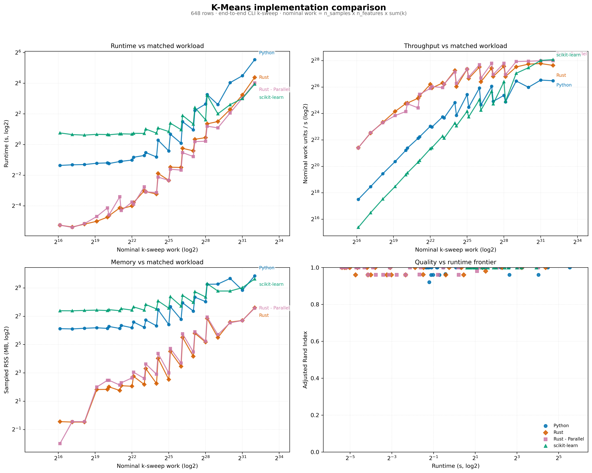

<section class="hero-titan">
  

    A K-Means clustering study
    <h1>Four execution paths. One measured workload.</h1>
    

      Pure Python, hand-rolled Rust, Rayon-parallel Rust, and scikit-learn measured as end-to-end CLI k-sweeps. With a live in-browser WebAssembly demo of the Rust implementation.
    

    

      <a class="btn-primary" href="{{ '/demo/'       | relative_url }}">Try the live demo</a>
      <a class="btn-ghost"   href="{{ '/benchmarks/' | relative_url }}">View benchmarks</a>
    

  

  

    <svg viewBox="0 0 400 400" xmlns="http://www.w3.org/2000/svg" aria-hidden="true">
      <defs>
        <pattern id="grid" width="40" height="40" patternUnits="userSpaceOnUse">
          <path d="M 40 0 L 0 0 0 40" fill="none" stroke="#d8d3cc" stroke-width="0.5"/>
        </pattern>
      </defs>
      <rect width="400" height="400" fill="url(#grid)"/>
      <!-- Cluster A -->
      <g fill="#111111">
        <circle cx="100" cy="120" r="5"/><circle cx="120" cy="100" r="5"/>
        <circle cx="90" cy="140" r="5"/><circle cx="135" cy="125" r="5"/>
        <circle cx="115" cy="145" r="5"/><circle cx="105" cy="105" r="5"/>
        <circle cx="125" cy="155" r="5"/><circle cx="95" cy="115" r="5"/>
      </g>
      <!-- Cluster B -->
      <g fill="#111111">
        <circle cx="280" cy="110" r="5"/><circle cx="295" cy="130" r="5"/>
        <circle cx="265" cy="125" r="5"/><circle cx="305" cy="105" r="5"/>
        <circle cx="290" cy="150" r="5"/><circle cx="275" cy="95" r="5"/>
        <circle cx="310" cy="140" r="5"/><circle cx="285" cy="135" r="5"/>
      </g>
      <!-- Cluster C -->
      <g fill="#111111">
        <circle cx="190" cy="280" r="5"/><circle cx="210" cy="290" r="5"/>
        <circle cx="175" cy="275" r="5"/><circle cx="220" cy="270" r="5"/>
        <circle cx="200" cy="305" r="5"/><circle cx="185" cy="295" r="5"/>
        <circle cx="215" cy="305" r="5"/><circle cx="195" cy="265" r="5"/>
      </g>
      <!-- Centroids -->
      <g stroke="#ff9900" stroke-width="2.5" fill="none">
        <path d="M105,125 l16,0 M113,117 l0,16"/>
        <path d="M283,125 l16,0 M291,117 l0,16"/>
        <path d="M193,285 l16,0 M201,277 l0,16"/>
      </g>
      <!-- Voronoi-ish lines -->
      <g stroke="#615e5b" stroke-width="1" fill="none" opacity="0.5">
        <line x1="195" y1="0" x2="205" y2="200"/>
        <line x1="0" y1="220" x2="400" y2="200"/>
      </g>
    </svg>
  

</section>

At a glance

  

    5.1×
    Rust-Parallel over pure-Python - paired median speedup
  

  

    0.61
    MB / 1k samples - median Rust sampled RSS
  

  

    1.00
    Median ARI under single-start k-means++
  

  

    648
    Rows in the 2026-06-09 benchmark suite
  

**What was measured in the benchmark suite**

| Field | Value |
|---|---|
| Source CSV | `benchmark_results_20260609_112255.csv` |
| Workload | End-to-end CLI k-sweep, including process launch, CSV read, fitting k = 1..k_max, and output CSV writing |
| Grid | Sample sizes 1k, 2k, 4k, 8k, 16k, 32k, 64k, 128k, and 256k across feature counts 2, 8, 32 and k_max values 8, 32 with three paired repeats |
| Implementations | Python, scikit-learn, Rust, Rust-Parallel |
| Initialization policy | Single-start k-means++ for all implementations; scikit-learn `n_init=1` |
| Memory metric | Sampled process RSS polled every 10 ms, not platform max RSS |
| Resource metrics | Wall time, CPU time, effective cores, sampled RSS, normalized throughput, and paired speedups |
| Quality metrics | ARI/NMI use full ground-truth labels; expensive internal metrics are sampled at 10k rows for the largest workloads |

The current benchmark suite was generated on June 9, 2026. Each workload is generated from scratch and run through all four implementations before medians are computed. The sample axis follows a log2 doubling sequence from 1k through 256k rows.

## Runtime and resource use: Rust wins the matched CLI workload

Median CLI k-sweep runtime over the suite: Rust-Parallel 0.197 s, Rust 0.201 s, Python 0.806 s, and scikit-learn 1.843 s. On paired workload rows, Rust-Parallel has a 5.1x median speedup over pure Python and serial Rust has a 4.5x median speedup.

At the largest workload, 256k samples x 32 features x k_max=32, scikit-learn is fastest at 15.36 s but uses 795 MB sampled RSS. Rust-Parallel takes 16.23 s at 190 MB, serial Rust takes 20.76 s at 194 MB, and pure Python takes 46.46 s at 924 MB.

The headline is about end-to-end CLI throughput, not isolated algorithm kernel time. Startup, CSV I/O, and writing all cluster columns for k = 1..k_max are included by design.

## Memory: directional, not exact

Median sampled RSS per 1 000 samples: Rust 0.61 MB, Rust-Parallel 0.73 MB, Python 7.41 MB, and scikit-learn 12.63 MB. Rust is still the clear memory leader in this measurement, but the metric is a 10 ms RSS poll of the process, not a platform max-RSS reading. Exact ratios should be read as directional.

The Rust implementation is not a fully flat matrix layout. It stores rows as `DataPoint { id: String, features: Vec<f64> }`, so the current memory advantage comes from avoiding NumPy-style full distance matrices and Python object/runtime overhead, not from a perfectly contiguous `n x d` matrix representation.

## Quality: single-start k-means++ largely closes the gap

Median ARI is 1.00 for all four implementations on the suite. Mean ARI still shows a small gap: scikit-learn 0.999, Python 0.980, and both Rust paths 0.974. That residual comes from occasional single-start misses, not a systematic mismatch between serial and parallel Rust; those two paths produce identical quality metrics. Internal quality metrics for the largest workloads use a deterministic 10k-row sample to avoid quadratic silhouette-score cost on laptop hardware.

Because the suite uses k-means++ and `n_init=1` for scikit-learn, it compares implementation mechanics under a common single-start policy. A restart-policy ablation would be needed to compare "best of N starts" strategies.

## Parallel Rust: useful only at larger scales

In the balanced suite, Rust-Parallel is slightly faster than serial Rust by median wall time: 0.197 s vs 0.201 s. The companion Rust-only thread sweep spans 1k through 256k rows at 32 features and `k_max=32`; the best observed speedup is 1.32x at 256k rows, while 8+ threads are a regression on some small slices.

Two changes would likely shift the cross-over down: a genuinely flat data matrix and a benchmark grid that distinguishes one large `k = k_max` fit from many small fits in the CLI sweep. Until those land, the parallel binary is a useful experiment rather than the default path.

  <h2>Open the live demo.</h2>
  
Generate two-moons data, watch Lloyd's algorithm fail in real time, then try the same data with k-means++ — all in your browser.

  

    <a class="btn-primary" href="{{ '/demo/' | relative_url }}">Open the live demo</a>
    <a class="btn-ghost"   href="https://github.com/nilesh-patil/pythonvsrust-kmeans">Star on GitHub</a>
  

