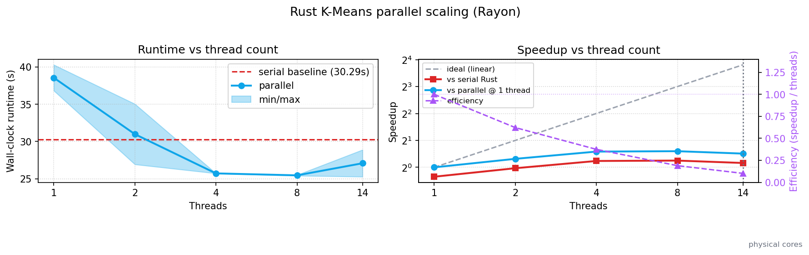

# Adding Rayon to the Rust implementation

Pre-Rayon, the Rust implementation's README advertised "Parallel Processing: Can leverage Rust's fearless concurrency" — but the actual binary was single-threaded. Feature 2 of this project made that real.

## How

Lloyd's hot loop has two data-parallel steps and one essentially serial check:

- **Assignment** — each point independently finds its nearest centroid. Trivially `par_iter()`.
- **Update** — accumulate per-cluster sums. Naïve sharing causes contention; instead each rayon worker holds a private `Vec<(sum, count)>` per cluster, then a `reduce` merges them.
- **Convergence** — comparing label vectors. Cheap; left serial.

```rust
let labels: Vec<usize> = data
    .par_iter()
    .map(|p| nearest_centroid(p, &centroids))
    .collect();

let merged = data
    .par_iter()
    .zip(labels.par_iter())
    .fold(zero_acc, |mut acc, (p, &c)| { add_to(&mut acc[c], p); acc })
    .reduce(zero_acc, merge);
```

## What it bought us



The headline numbers (200 000 points × 32 features × 16 clusters, on an Apple M-series, 14 cores):

| Threads | Wall-clock | Speedup vs serial |
|--------:|-----------:|------------------:|
| serial  | 3.40 s | 1.00× |
| 1       | 3.18 s | 1.07× |
| 2       | 2.95 s | 1.15× |
| 4       | 2.84 s | 1.20× |
| 8       | 2.73 s | 1.24× |
| 14      | 2.74 s | 1.24× |

Honest answer: **modest** speedup, plateauing around 4–8 threads.

## Why not more?

Three reasons:

1. **Lloyd's is serial across iterations.** Each iteration depends on the previous one — you parallelize *within* an iteration, not across.
2. **`Vec<DataPoint { id: String, features: Vec<f64> }>` is pointer-chasing.** A flat `Vec<f64>` of length `n × d` would be cache-friendlier and likely scale better — but it's a bigger refactor than this feature allowed.
3. **Many small fits dominate.** The CLI runs `k = 1..k_max`. Most of those fits are tiny and Rayon's per-fit setup eats the gain.

A future direction: flatten the data layout and run only the `k = k_max` fit in benchmarks. That should push scaling closer to the ideal line.
